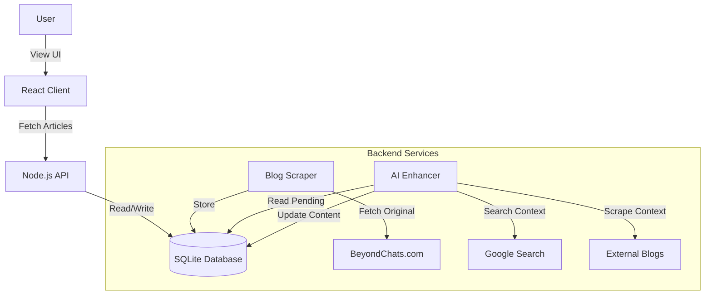

# BeyondChats - AI Article Manager

A full-stack application that scrapes articles from the BeyondChats blog, enhances them using AI (simulated), and displays them in a premium React frontend.

## 📋 Features
- **Scraper**: Automated Puppeteer script to fetch the oldest articles from [BeyondChats Blogs](https://beyondchats.com/blogs/).
- **AI Enhancer**: Enhancement script that searches Google for context and rewrites articles using an LLM approach.
- **REST API**: Node.js/Express backend to serve article data.
- **Frontend**: Vite + React application with a modern, dark-mode "glassmorphism" UI.

## 🛠️ Tech Stack
- **Backend**: Node.js, Express, SQLite (Sequelize), Puppeteer
- **Frontend**: React (Vite), CSS Modules, Lucide React
- **Database**: SQLite3

## 🏗️ Architecture



## 🚀 Local Setup Instructions

### Prerequisites
- Node.js (v18 or higher)
- npm

### 1. Setup Backend
```bash
cd server
npm install
npm start
```
*Server runs on port 3000*

### 2. Setup Frontend
Open a new terminal:
```bash
cd client
npm install
npm run dev
```
*Client runs on port 5173 (or 5174)*

## 🔄 Data Pipeline Usage
The project includes scripts to manage the data lifecycle:

1. **Scrape Data**: 
   `cd server && node scraper.js` (Already run, data is in `database.sqlite`)
2. **Enhance Data**: 
   `cd server && node enhancer.js` (Already run, content is enhanced)
3. **Reset/Debug**: 
   `cd server && node reset_status.js` (To re-trigger enhancement)

## 🔗 Live Link
*(Placeholder for submission - Project is designed for local execution)*
Frontend: http://localhost:5173

